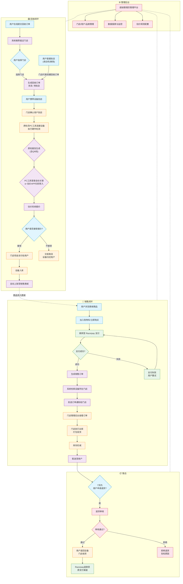

# 印度二手消费电子交易平台 — 产品需求文档 (PRD)

> **文档版本**: v1.0  
> **创建日期**: 2026-05-27  
> **业务范围**: 全印度  
> **设备类型**: 二手手机、平板、笔记本电脑  
> **支付网关**: Razorpay

---

## 1. 文档概述

### 1.1 文档目的

本文档旨在全面定义印度二手消费电子设备交易平台的产品需求，覆盖 **回收（Recycle）** 和 **销售（Sales）** 两大核心闭环流程。为产品、设计、开发、测试和运营团队提供统一的参考标准。

### 1.2 业务范围

| 维度 | 范围 |
|------|------|
| 设备品类 | 手机、平板电脑、笔记本电脑 |
| 地理范围 | 全印度，逐步覆盖各邦 |
| 支付方式 | 回收端：现金；销售端：Razorpay（卡片/UPI/网银/钱包） |
| 用户角色 | 普通用户、门店店员/店长、质检员、超级管理员 |

### 1.3 术语定义

| 术语 | 说明 |
|------|------|
| 回收订单 | 用户将旧设备出售给平台的订单 |
| 质检报告 (QC Report) | PC检测工具对设备进行检测后生成的报告，含硬件状况、外观等级等 |
| 估价系统 (APP) | 质检员使用的移动应用，可扫码导入质检报告并定价 |
| 回收估价 | 根据质检报告对设备给出的回收报价 |
| 销售商城 | 面向终端消费者的二手设备在线商城 |
| 出库 (Outbound) | 门店将已销售设备打包发货的流程 |

---

## 2. 产品背景与目标

### 2.1 市场背景

印度二手消费电子市场规模估计超过 **50亿美元**，年增长率约15-20%。主要驱动力包括：
- 智能手机渗透率快速提升，换机周期约24-30个月
- 中低收入群体对高性价比二手设备需求旺盛
- 印度政府推动数字化支付（UPI/Razorpay）为线上交易提供基础设施
- 环保意识提升推动电子垃圾回收再利用

### 2.2 产品目标

1. 建立从回收、质检、估价到销售的全闭环交易平台
2. 实现门店网络覆盖主要城市，提供就近回收服务
3. 通过标准化质检和估价系统，确保设备质量和价格透明度
4. 提供线上线下融合（OMO）体验：用户可在线下单到店交易，或直接到店

### 2.3 关键指标 (KPIs)

| 指标 | 目标 |
|------|------|
| 回收订单转化率 | ≥ 60% |
| 质检到估价完成时间 | ≤ 24小时 |
| 估价成交率 | ≥ 70% |
| 商城 7 天退货率 | ≤ 5% |
| 门店24 小时出库率 | ≥ 95% |
| 支付成功率 | ≥ 98% |

---

## 3. 用户角色定义

### 3.1 普通用户 (User)

| 属性 | 描述 |
|------|------|
| 访问方式 | 回收平台网页/APP + 销售商城网页/APP |
| 权限 | 浏览、下单回收、浏览商城、下单购买、查看订单状态 |

### 3.2 门店店员/店长 (Store Staff)

| 属性 | 描述 |
|------|------|
| 访问方式 | 门店管理后台 (Web) |
| 权限 | 接收回收订单通知、确认用户到店、执行出库操作、管理门店库存、查看门店回收和销售数据 |

### 3.3 质检员 (Quality Inspector)

| 属性 | 描述 |
|------|------|
| 访问方式 | PC质检工具 + 估价 APP (移动端) |
| 权限 | 连接设备执行质检、生成质检报告、通过估价 APP 定价、确认估价成交 |

### 3.4 超级管理员 (Super Admin)

| 属性 | 描述 |
|------|------|
| 访问方式 | 平台管理后台 (Web) |
| 权限 | 管理所有门店、管理用户和角色、查看全局数据报表、配置系统参数、管理设备品类和估价规则 |

---

## 4. 核心业务流程

### 4.1 回收流程 (Recycle Flow)

#### 4.1.1 线上下单回收

```
用户在线提交回收意向
 ↓
系统根据用户位置推荐就近门店 (按距离排序)
    ↓
用户选择门店 → 生成回收订单
    ↓
用户携带设备到选定的线下门店
    ↓
门店店员在系统中确认用户到店
    ↓
进入质检环节
```

#### 4.1.2 直接到店回收/换购

```
用户直接到门店
    ↓
用户希望：A) 直接出售旧机  B) 购买新机时旧机抵扣
    ↓
店员在系统中创建回收订单（选择该用户或创建新用户档案）
    ↓
进入质检环节
```

#### 4.1.3 质检与估价流程

```
门店质检员使用 PC 工具连接设备
    ↓
PC 工具自动运行检测项目：
 - 屏幕检测（坏点、亮度、触摸）
 - 电池健康度
 - 摄像头功能
  - 按键/接口功能
  - 主板/基带检测
  - 外观等级评估
    ↓
生成质检报告（含 QR码）
    ↓
质检员通过 PC 工具登录账号 → 报告自动关联至估价系统账号
    OR
质检员打开估价 APP → 扫码导入报告
    ↓
估价系统根据质检报告 + 当前市场行情 → 给出回收报价
    ↓
门店店员向用户展示报价
    ↓
用户确认接受报价？→ 是 → 交易成交
 → 否 → 交易取消，设备归还用户
    ↓
成交：门店现金支付给用户
    ↓
设备入库 → 自动上架至销售商城
```

### 4.2 销售流程 (Sales Flow)

#### 4.2.1 用户在线下单

```
用户在商城浏览二手设备
    ↓
选择设备加入购物车/立即购买
    ↓
下单 → 跳转至 Razorpay 支付页面
    ↓
用户选择支付方式（信用卡/借记卡/UPI/网银/钱包）
    ↓
Razorpay 处理支付
    ↓
支付成功 → 生成销售订单
    ↓
支付失败 → 用户可选择重试或更换支付方式
```

#### 4.2.2 订单履约流程

```
销售系统接收新订单
    ↓
系统自动检索该设备所在门店库存
    ↓
发送订单通知给对应门店（门店管理后台 + 可选短信通知）
    ↓
门店店员在后台查看待出库订单
    ↓
店员执行出库操作：
  1. 找到对应设备
2. 设备打包、贴单
3. 在后台扫描/确认出库
    ↓
库存扣减
    ↓
配送（可对接第三方物流）
    ↓
用户收到设备
```

### 4.3 售后流程

```
用户收到设备后 7 天内可申请退货
    ↓
退货原因审核（质量问题 / 与描述不符 / 无理由退货）
    ↓
审核通过 → 用户退回设备 → 门店收货 → 退款到原支付渠道
    ↓
审核拒绝 → 拒绝原因告知用户
```

---

## 5. 功能需求清单

### 5.1 用户端 - 回收平台 (P0: 必须有, P1: 应有, P2: 可有)

| ID | 功能 | 描述 | 优先级 |
|----|------|------|--------|
| REC-01 | 回收首页 | 展示回收流程、设备品类、预估价格范围 | P0 |
| REC-02 | 填写设备信息 | 用户选择设备品牌、型号、购买年份、外观状况等 | P0 |
| REC-03 | 门店推荐 | 基于用户位置推荐就近门店（列表 + 地图视图） | P0 |
| REC-04 | 回收订单管理 | 查看订单状态（待到店/质检中/已报价/已完成/已取消） | P0 |
| REC-05 | 价格预估 | 根据用户填写的信息给出大致回收价格范围 | P1 |
| REC-06 | 门店详情 | 门店地址、营业时间、联系方式、用户评价 | P1 |

### 5.2 用户端 - 销售商城

| ID | 功能 | 描述 | 优先级 |
|----|------|------|--------|
| SEL-01 | 商品列表 | 按品类、价格、成色筛选排序 | P0 |
| SEL-02 | 商品详情 | 设备照片、质检报告摘要、价格、库存 | P0 |
| SEL-03 | 购物车 | 加入/移除商品、修改数量 | P0 |
| SEL-04 | 下单支付 | 集成 Razorpay Mobile SDK 完成支付 | P0 |
| SEL-05 | 订单管理 | 查看订单状态（待支付/待发货/已发货/已完成/已退货） | P0 |
| SEL-06 | 搜索 | 关键字搜索设备 | P1 |
| SEL-07 | 设备对比 | 对比多台设备的配置和价格 | P2 |

### 5.3 质检系统

| ID | 功能 | 描述 | 优先级 |
|----|------|------|--------|
| QC-01 | PC质检工具 | USB 连接设备，自动检测硬件状态 | P0 |
| QC-02 | 质检报告生成 | 结构化的报告，含各检测项结果、图片证据 | P0 |
| QC-03 | 报告 QR码 | 每份质检报告生成唯一 QR 码 | P0 |
| QC-04 | 估价 APP 扫码导入 | APP 通过摄像头扫码获取质检报告 | P0 |
| QC-05 | PC 工具自动关联 | PC 质检工具登录后自动关联到质检员估价账号 | P0 |
| QC-06 | 估价定价 | 根据质检结果 + 市场行情定价，支持手动调价 | P0 |
| QC-07 | 质检历史 | 查看历史质检记录和报告 | P1 |
| QC-08 | 设备信息数据库 | 预加载各品牌型号的检测基线数据 | P1 |

### 5.4 门店管理后台

| ID | 功能 | 描述 | 优先级 |
|----|------|------|--------|
| STO-01 | 回收订单管理 | 查看分配给本店的回收订单，确认用户到店 | P0 |
| STO-02 | 库存管理 | 查看本店库存（在库设备列表、数量、状态） | P0 |
| STO-03 | 出库管理 | 处理销售订单出库，扫描确认发货 | P0 |
| STO-04 | 销售订单管理 | 查看本店需发货的订单 | P0 |
| STO-05 | 门店营收报表 | 回收支出统计、销售收入统计 | P1 |
| STO-06 | 门店信息设置 | 编辑门店地址、营业时间、联系方式 | P1 |

### 5.5 超级管理后台

| ID | 功能 | 描述 | 优先级 |
|----|------|------|--------|
| ADM-01 | 门店管理 | 添加/编辑/禁用门店，分配门店管理员 | P0 |
| ADM-02 | 用户管理 | 管理所有用户角色和权限 | P0 |
| ADM-03 | 全局仪表盘 | 回收量、销售量、营收、转化率等关键数据 | P0 |
| ADM-04 | 估价规则配置 | 配置设备估价模型参数 | P1 |
| ADM-05 | 设备品类管理 | 管理支持的品牌和型号 | P1 |
| ADM-06 | 运营报表 | 自定义时间范围的详细数据报表 | P1 |

### 5.6 Razorpay 支付集成

| ID | 功能 | 描述 | 优先级 |
|----|------|------|--------|
| PAY-01 | 支付发起 | 通过 Razorpay Mobile SDK 发起支付请求 | P0 |
| PAY-02 | 支付方式 | 支持信用卡、借记卡、UPI、网银、钱包 | P0 |
| PAY-03 | 支付回调 | 处理支付成功/失败回调，更新订单状态 | P0 |
| PAY-04 |退款处理 | 售后退款通过 Razorpay 原路退回 | P0 |
| PAY-05 | 支付对账 | 每日支付对账单，与平台订单对账 | P1 |
| PAY-06 | 分期付款 | 支持 Razorpay 的 EMI分期选项 | P2 |

---

## 6. 非功能需求

### 6.1 性能需求

| 指标 | 要求 |
|------|------|
| 页面加载时间 | ≤ 2秒 (P95) |
| API 响应时间 | ≤ 500ms (P95) |
| 支付接口响应时间 | ≤ 3 秒 (P95) |
| 系统可用性 | 99.9% (每月停机 ≤ 43 分钟) |
| 并发用户支持 | 初始1000 QPS，可水平扩展 |

### 6.2 安全需求

| 要求 | 说明 |
|------|------|
| 数据传输加密 | 所有 API 使用 HTTPS/TLS 1.2+ |
| 用户认证 | JWT Token + OTP 验证 |
| PCI DSS 合规 | Razorpay 处理支付数据，平台不存储持卡人信息 |
| 敏感数据加密 | 用户个人信息、设备 IMEI 等加密存储 |
| 接口防重放 | 关键操作接口防重放攻击 |
| GDPR/DPDPA | 符合印度《数字个人数据保护法》(DPDPA 2023) |

### 6.3 合规性

| 法规 | 要求 |
|------|------|
| DPDPA 2023 | 用户数据处理需征得同意，提供数据删除机制 |
| IT Act 2000 | 电子合同和数字签名的法律效力 |
| Consumer Protection Act 2019 | 退货、退款、保修相关条款合规 |
| GST | 二手商品交易的 GST 税务合规 (通常 12-18%) |
| PCI DSS | Razorpay 集成无需平台持证，但传输过程需加密 |
| Legal Metrology Act |在线商品展示需标明价格、制造商信息等 |

---

## 7. 数据实体关系概览

### 核心实体

```
User (用户)
 ├── id, name, phone, email, address, role, created_at
  │
  ├── RecycleOrder (回收订单)
  │   ├── id, user_id, store_id, device_info, status, created_at
  │   ├── QCReport (质检报告)
  │   │   ├── id, order_id, inspector_id, items, images, qr_code
  │   │ └── Valuation (估价)
  │   │       ├── id, report_id, proposed_price, final_price, status
  │ └── Transaction (交易记录)
  │       └── id, order_id, amount, type(cash), created_at
  │
  ├── SaleOrder (销售订单)
  │   ├── id, user_id, store_id, device_id, total, status, created_at
  │   ├── Payment (支付)
  │   │ └── id, order_id, razorpay_id, amount, status
  │ └── Outbound (出库记录)
  │ └── id, order_id, store_id, operator, tracking_no, status
  │
  ├── Device (设备)
  │   ├── id, category, brand, model, grade, qc_report_id
  │   ├── Inventory (库存)
  │   │   └── id, device_id, store_id, status(in_stock/sold), location
  │
  ├── Store (门店)
  │   ├── id, name, address, lat, lng, contact, status
  │
  └── Admin / Inspector
 ├── id, user_id, store_id, role, permissions
```

---

## 8. 流程图

### 全闭环业务流程图



---

## 9. 技术架构建议

### 9.1 整体架构

| 层级 | 技术选择 |
|------|----------|
| 客户端 APP | React Native (跨平台，支持 iOS/Android) |
| 管理后台 Web | React / Vue.js |
| API 网关 | Nginx / Kong |
|后端服务 | Node.js / Go (微服务架构) |
| 数据库 | PostgreSQL (主库) + Redis (缓存) |
| 搜索引擎 | Elasticsearch (商品搜索) |
| 消息队列 | RabbitMQ / Kafka (订单通知等) |
| 对象存储 | AWS S3 / MinIO (设备图片、质检报告) |
| 支付集成 | Razorpay Mobile SDK + Web SDK |
| 部署 | Docker + Kubernetes |
| CI/CD | GitHub Actions / GitLab CI |

### 9.2 微服务划分建议

| 服务 | 职责 |
|------|------|
| User Service | 用户注册、登录、角色管理 |
| Store Service | 门店信息、推荐、管理 |
| Order Service | 回收/销售订单管理 |
| QC Service | 质检报告管理、存储 |
| Valuation Service | 估价定价、行情管理 |
| Inventory Service | 库存管理、入库/出库 |
| Payment Service | Razorpay 集成、支付处理 |
| Notification Service | 订单通知推送 |
| Product Service | 商品管理、商城展示 |
| Admin Service | 管理后台 API |

### 9.3 Razorpay 集成要点

1. **SDK 选择**: 使用 `RazorpayCheckout` Mobile SDK (Android/iOS)
2. **支付流程**:服务端生成订单 → 客户端调起 SDK → 用户支付 → Webhook 回调更新订单
3. **安全**: 使用 Razorpay 签名验证机制，防止支付篡改
4. **退款**: 通过 Razorpay 的 `Payment.refund()` API 处理售后退款
5. **对账**: 每日下载 settlement 报告与平台订单对账

---

## 10. 附录

### 10.1 优先级说明

| 优先级 | 说明 |
|--------|------|
| P0 | MVP 必须实现的核心功能 |
| P1 | 重要但可先上线后快速迭代 |
| P2 | 可有可无，可长期规划 |

### 10.2 术语补充

| 术语 | 说明 |
|------|------|
| UPI | Unified Payments Interface，印度统一支付接口 |
| GST | Goods and Services Tax，印度商品与服务税 |
| DPDPA | Digital Personal Data Protection Act，印度数字个人数据保护法 |
| IMEI | International Mobile Equipment Identity，国际移动设备标识 |
